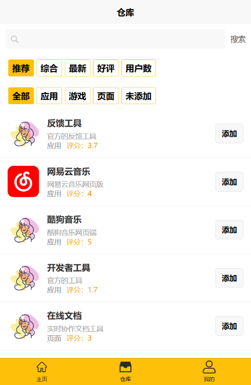
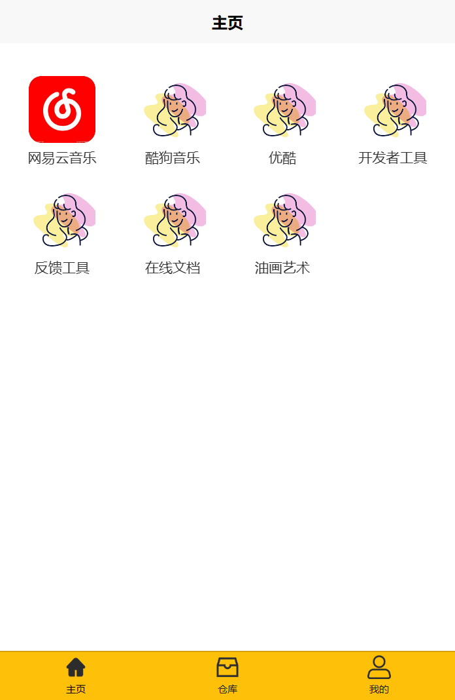
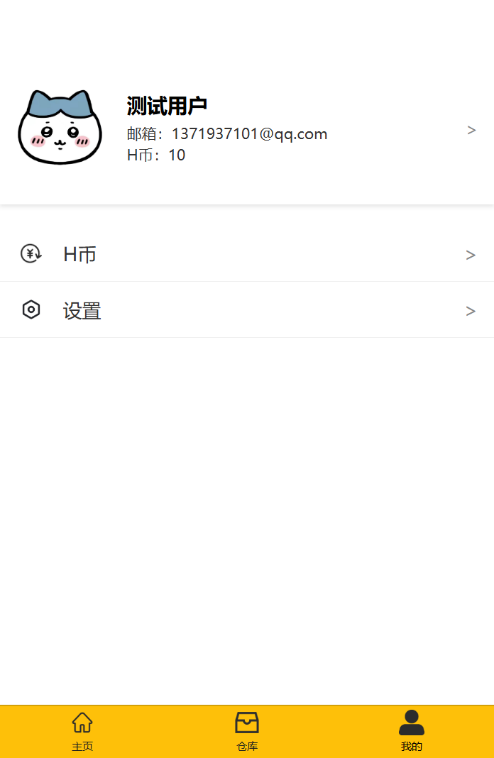

# 应用仓库项目手册

## 应用仓库(APP 开发)项目介绍

**什么是应用仓库？**

应用仓库（简称仓库）是由福州倍司网络科技有限公司开发的一款 APP，它为用户提供了便捷的使用网页端应用（简称 H5）的平台。  

**应用仓库的开发背景？**

- 随着 AI 的发展，会有越来越多的独立开发者的出现
- 国内软件广告泛滥、体积臃肿、功能冗余
- 微信小程序对开发者的审核比较严格，对于开发者开放的类目太少

**应用仓库的前景？**

- **更成熟的技术** H5 技术的成熟
- **更开放的生态** 应用审核更宽松、更快速（对比小程序平台）
- **更友好的生态** 绿色无广告、全免费
- **更便捷的生态** 点开即用、无须下载
- **更低的使用成本** 页面简单易操作

**应用仓库解决了用户（包括开发者）的哪些痛点？**

- **对于用户**：手机 APP 占用内存大、广告弹窗多、功能复杂且冗余

- **对于开发者**：应用审核要求严格、上架成本高

**应用仓库的功能与优势？**

应用仓库提供了网页端应用（以下简称 H5）的入口，可以让用户快捷打开开发者提供的网页端应用。

开发者可以免费上架他开发的 H5（包括应用、游戏、甚至是宣传页面）；用户可以完全免费使用开发者提供的 H5 应用。绿色无广告、内存占用低。

**应用仓库如何营造好的网页端应用生态？**

首先，用户可以通过对开发者发布的应用进行评价，也可以使用代币对开发者进行奖励，仓库会优先推送用户评分高的 H5 供用户使用，H5 评分过低会被强制下架。其次，开发者可以使用代币让自己的应用或者更多的推荐曝光。最后，用户和开发者都可以使用代币从平台的盈利中获取奖励。

**应用仓库如何实现盈利？**

- **前期**：收取开发者的应用在仓库的推流费用

- **后期**：对开发者售卖的 H5 应用抽成

---

## 开发者必读

**项目网址**

https://hsck.beisi.tech/

**应用仓库的开发技术栈**

- **前端** Vue.js
- **后端** Python-Flask
- **数据库** MySQL

**前后端接口文档**

https://app.apifox.com/project/6209785

**各个 URL 的所对应的功能**
| URL | 功能 |
|-------------------------|----------------------------|
beisi.tech/hsck/ | 应用仓库项目官网
hsck.beisi.tech/hsck/ | 反向代理到 beisi.tech/hsck  
hsck.beisi.tech/api/ | 应用仓库 后端应用程序接口
hsck.beisi.tech/h5manage/ | 应用仓库开发者工具 h5 前端
hsck.beisi.tech/h5manage/api/ | 应用仓库开发者工具后端
hsck.beisi.tech/appreview/ | 应用仓库审核 web 前端
hsck.beisi.tech/appreview/api/ | 应用仓库审核 后端
hsck.beisi.tech/event/ | 应用仓库活动 h5 前端
hsck.beisi.tech/event/api/ | 应用仓库活动后端
hsck.beisi.tech/feedback/ | 应用仓库反馈 h5 前端
hsck.beisi.tech/feedback/api/ | 应用仓库反馈后端
hsck.beisi.tech/exchange_tutorial/ | 应用仓库兑换教程
hsck.beisi.tech/pay/ | 应用仓库支付 h5 前端
hsck.beisi.tech/pay/api/ | 应用仓库支付后端
cdn.beisi.tech/hsck/ | oss 应用仓库 加速资源
